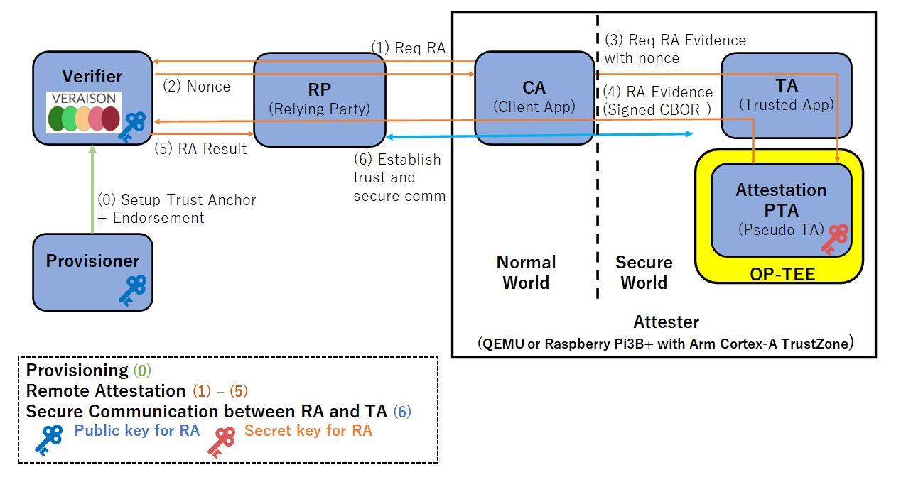

# OP-TEE Remote Attestation with VERAISON Verification.

This document explains how to set up the [OP-TEE](https://github.com/OP-TEE/optee_os) Remote Attestation and [VERAISON](https://github.com/veraison) Verification using QEMU and Docker containers.
It can run on Rasperry Pi 3B+  (Arm Cortex-A TrustZone).

The following figure shows the steps for provisioning (0), remote attestation (1)-(5), and secure communication (6).



## Prerequisites

To run the developed artifacts, you need to prepare an environment that meets the following requirements:

* Docker is installed
* Docker daemon is running
* Ensure that 30-40GB of disk space is available for Docker (you can check this with `docker system df`). If the available space is insufficient, it is recommended to free up space using `docker system prune --volumes --all`.
* `jq` is installed (on Ubuntu, you can install it with `sudo apt-get install jq`)

## Execution Method

Follow these steps from 1 to 6 to test the entire process of remote attestation.


### 1. Starting the Services Provided by Veraison

Retrieve the Veraison source from GitHub.


```sh
git clone https://github.com/veraison/services.git -b v0.0.2502 --depth 1
```

You may see the following message, but it is not a problem.
```
You are in 'detached HEAD' state. You can look around, make experimental
changes and commit them, and you can discard any commits you make in this
state without impacting any branches by switching back to a branch.

If you want to create a new branch to retain commits you create, you may
do so (now or later) by using -c with the switch command. Example:

  git switch -c <new-branch-name>

Or undo this operation with:

  git switch -

Turn off this advice by setting config variable advice.detachedHead to false
```

Next, start the services that will run on the host machine.
You can start Veraison with the following commands. Note that the startup process may take some time.
```sh
make -C services docker-deploy
```

After starting the services, you can check their status with the following command. If you are using zsh, execute `source services/deployments/docker/env.zsh` instead of `source services/deployments/docker/env.bash` .


```sh
source services/deployments/docker/env.bash
veraison status
```

If the Veraison services start successfully, you will get output similar to the following.

```txt
         vts: running
provisioning: running
verification: running
  management: running
    keycloak: running
```

### 2. Executing the Provisioning

Use the following commands to register the `trust anchor` and `reference value` with the Verifier. These values are used to verify the evidence sent by the Attester. If you want to change the values to be registered, modify the files under `provisioning/data`.

```sh
./provisoning/run.sh
```

You can check the registered values with the following command.
```sh
veraison stores
```

If the registration is successful, you will get the following output. This indicates the values registered with the Verifier.

```txt
TRUST ANCHORS:
--------------
{
  "scheme": "PSA_IOT",
  "type": "trust anchor",
  "subType": "",
  "attributes": {
    "hw-model": "RoadRunner",
    "hw-vendor": "ACME",
    "iak-pub": "-----BEGIN PUBLIC KEY-----\nMFkwEwYHKoZIzj0CAQYIKoZIzj0DAQcDQgAEMKBCTNIcKUSDii11ySs3526iDZ8A\niTo7Tu6KPAqv7D7gS2XpJFbZiItSs3m9+9Ue6GnvHw/GW2ZZaVtszggXIw==\n-----END PUBLIC KEY-----",
    "impl-id": "YWNtZS1pbXBsZW1lbnRhdGlvbi1pZC0wMDAwMDAwMDE=",
    "inst-id": "Ac7rrnuJJ6MiflMDz14PH3s0u1Qq1yUKwD+83jbsLxUI"
  }
}

ENDORSEMENTS:
-------------
{
  "scheme": "PSA_IOT",
  "type": "reference value",
  "subType": "platform.sw-component",
  "attributes": {
    "hw-model": "RoadRunner",
    "hw-vendor": "ACME",
    "impl-id": "YWNtZS1pbXBsZW1lbnRhdGlvbi1pZC0wMDAwMDAwMDE=",
    "measurement-desc": "sha-256",
    "measurement-type": "PRoT",
    "measurement-value": "D0JzrYvFZbi5gzXBgvKZ2f5K34LdnjVo/IFSOQRHqpc=",
    "signer-id": "rLsRx+TaIXIFUjzkzhokWuGiOa48a/2eeHH35di66Gs="
  }
}
```

`TRUST ANCHORS` indicate the data used to verify the signature of the evidence sent by the Attester. The evidence sent by the Attester includes `impl-id` and `inst-id`, which the Verifier uses to identify which `TRUST ANCHOR` to use for verification. The Verifier uses the identified signature key (public key) to verify the evidence in CBOR(COSE) format.


* `iak-pub`: The public key used to verify the signature of the evidence (In this project, the ECDSA w/ SHA256 algorithm is used for signatures. This is because the generated evidence is in CBOR(COSE) format, which conforms to the specifications in [RFC 8152](https://datatracker.ietf.org/doc/html/rfc8152#section-8.1)).
* `impl-id`: The ID of the Attester
* `inst-id`: The ID of the public key


`ENDORSEMENTS` indicate the data (oracle) used to verify the content of the evidence sent by the Attester. The evidence sent by the Attester includes `impl-id` and `measurement-value`, which the Verifier uses to identify which `ENDORSEMENT` to compare with the received evidence. The Verifier compares the `measurement-value` recorded in the identified `ENDORSEMENT` with the `measurement-value` included in the received evidence to verify the correctness of the code hash value. For other items and more detailed information, please refer to the specification [Arm's Platform Security Architecture (PSA) Attestation Token](https://datatracker.ietf.org/doc/draft-tschofenig-rats-psa-token/).
* `impl-id`: The ID of the Attester
* `measurement-value`: The code hash value (In this project, the SHA256 of the TA code that calls the PTA)


### 3. Starting the Relying Party

Next, start the container for the Relying Party and run the application. The Relying Party receives requests from the Attester and mediates communication between the Attester and the Verifier. Additionally, when the Verifier sends the attestation results, the Relying Party outputs them to the log.
```sh
./relying_party/container/start.sh
```

You can check the logs of the Relying Party with the following command.

```sh
docker logs relying-party-service
```

If it starts successfully, you will get output similar to the following.

```txt
go build -o rp main.go
./rp
2025/02/12 14:39:45 Relying party is starting...
```

### 4. Starting the Attester

Next, you will start the OP-TEE OS that sends the attestation request and run the program to communicate with the Verifier.


#### 4.1 Running the Attester

From the **Normal World** terminal, run the following command to start the attestation program:

```sh
optee_example_remote_attestation
```

If it executes successfully, you will see output similar to the following on the Normal World terminal:

```txt
Opened new Veraison client session at http://relying-party-service:8087/challenge-response/v1/session/0cdd0bb8-ea2d-11ef-a0db-353836663265

Number of media types accepted: 9
        application/eat+cwt; eat_profile="tag:psacertified.org,2023:psa#tfm"
        application/pem-certificate-chain
        application/eat-cwt; profile="http://arm.com/psa/2.0.0"
        application/vnd.enacttrust.tpm-evidence
        application/eat-collection; profile="http://arm.com/CCA-SSD/1.0.0"
        application/vnd.parallaxsecond.key-attestation.cca
        application/eat+cwt; eat_profile="tag:psacertified.org,2019:psa#legacy"
        application/vnd.parallaxsecond.key-attestation.tpm
        application/psa-attestation-token

Nonce size: 32 bytes
Nonce: [0xe3, 0x8, 0x8b, 0xaf, 0xfa, 0x10, 0x5a, 0x38, 0x20, 0x49, 0x2, 0x42, 0xaf, 0x82, 0x5b, 0xe8, 0x1b, 0x5a, 0x36, 0x23, 0xda, 0x75, 0x75, 0x35, 0x4, 0x1f, 0x60, 0x17, 0x50, 0xb9, 0xcb, 0x82]

Completed opening the session.


Invoke TA.
Invoked TA successfully.


Received evidence of CBOR (COSE) format from PTA.

CBOR(COSE) size: 306
CBOR(COSE): d28443a10126a058e7a71901097818687474703a2f2f61726d2e636f6d2f7073612f322e302e3019095a0119095b19300019095c582061636d652d696d706c656d656e746174696f6e2d69642d30303030303030303119095f81a3016450526f54025820b4d1c1e4fa7361970c08db12d2534c69afc1c57170586ade2d9c1f194fd6cd4c055820acbb11c7e4da217205523ce4ce1a245ae1a239ae3c6bfd9e7871f7e5d8bae86b0a5820e3088baffa105a3820490242af825be81b5a3623da757535041f601750b9cb82190100582101ceebae7b8927a3227e5303cf5e0f1f7b34bb542ad7250ac03fbcde36ec2f150858405ebd78e235bcf5d9c373c6162b26e43bfebb73c1de5a8fbecca5bf89b4b80938a34134f1f8068b79dfe49dc7e431884acdc21d2ec6adb591960ffc838a1782f4


Supplying the generated evidence to the server.

Received the attestation result from the server.

Raw attestation result (JWT): eyJhbGciOiJFUzI1NiIsInR5cCI6IkpXVCJ9.eyJlYXIudmVyaWZpZXItaWQiOnsiYnVpbGQiOiJOL0EiLCJkZXZlbG9wZXIiOiJWZXJhaXNvbiBQcm9qZWN0In0sImVhdF9ub25jZSI6IjR3aUxyX29RV2pnZ1NRSkNyNEpiNkJ0YU5pUGFkWFUxQkI5Z0YxQzV5NEk9IiwiZWF0X3Byb2ZpbGUiOiJ0YWc6Z2l0aHViLmNvbSwyMDIzOnZlcmFpc29uL2VhciIsImlhdCI6MTczOTQ2NjQ3MCwic3VibW9kcyI6eyJQU0FfSU9UIjp7ImVhci5hcHByYWlzYWwtcG9saWN5LWlkIjoicG9saWN5OlBTQV9JT1QiLCJlYXIuc3RhdHVzIjoid2FybmluZyIsImVhci50cnVzdHdvcnRoaW5lc3MtdmVjdG9yIjp7ImNvbmZpZ3VyYXRpb24iOjAsImV4ZWN1dGFibGVzIjozMywiZmlsZS1zeXN0ZW0iOjAsImhhcmR3YXJlIjoyLCJpbnN0YW5jZS1pZGVudGl0eSI6MiwicnVudGltZS1vcGFxdWUiOjIsInNvdXJjZWQtZGF0YSI6MCwic3RvcmFnZS1vcGFxdWUiOjJ9LCJlYXIudmVyYWlzb24uYW5ub3RhdGVkLWV2aWRlbmNlIjp7ImVhdC1wcm9maWxlIjoiaHR0cDovL2FybS5jb20vcHNhLzIuMC4wIiwicHNhLWNsaWVudC1pZCI6MSwicHNhLWltcGxlbWVudGF0aW9uLWlkIjoiWVdOdFpTMXBiWEJzWlcxbGJuUmhkR2x2YmkxcFpDMHdNREF3TURBd01ERT0iLCJwc2EtaW5zdGFuY2UtaWQiOiJBYzdycm51Sko2TWlmbE1EejE0UEgzczB1MVFxMXlVS3dEKzgzamJzTHhVSSIsInBzYS1ub25jZSI6IjR3aUxyL29RV2pnZ1NRSkNyNEpiNkJ0YU5pUGFkWFUxQkI5Z0YxQzV5NEk9IiwicHNhLXNlY3VyaXR5LWxpZmVjeWNsZSI6MTIyODgsInBzYS1zb2Z0d2FyZS1jb21wb25lbnRzIjpbeyJtZWFzdXJlbWVudC10eXBlIjoiUFJvVCIsIm1lYXN1cmVtZW50LXZhbHVlIjoidE5IQjVQcHpZWmNNQ05zUzBsTk1hYS9CeFhGd1dHcmVMWndmR1UvV3pVdz0iLCJzaWduZXItaWQiOiJyTHNSeCtUYUlYSUZVanpremhva1d1R2lPYTQ4YS8yZWVISDM1ZGk2NkdzPSJ9XX19fX0.bAqlTpkyWjURe8lSIbXGEgt5jeZjfcv-1GdNmHton4V5hp-CCrhbpc8Kx81bc3iew93sxQVvA8HFTsurespxUw

Disposing client session.

Completed sending the evidence and receiving the attestation result.
```

On the relying party side, you might see logs such as:

```txt
2025/02/13 17:07:48 Received request: POST /challenge-response/v1/newSession?nonceSize=32
2025/02/13 17:07:48 Received response: 201 Created
2025/02/13 17:07:50 Received request: POST /challenge-response/v1/session/0cdd0bb8-ea2d-11ef-a0db-353836663265
2025/02/13 17:07:50 Received response: 200 OK
2025/02/13 17:07:50 Attestation result: >> "/tmp/2907954672.jwt" signature successfully verified using "pkey.json"
[claims-set]
{
    "ear.verifier-id": {
        "build": "N/A",
        "developer": "Veraison Project"
    },
    "eat_nonce": "4wiLr_oQWjggSQJCr4Jb6BtaNiPadXU1BB9gF1C5y4I=",
    "eat_profile": "tag:github.com,2023:veraison/ear",
    "iat": 1739466470,
    "submods": {
        "PSA_IOT": {
            "ear.appraisal-policy-id": "policy:PSA_IOT",
            "ear.status": "warning",
            "ear.trustworthiness-vector": {
                "configuration": 0,
                "executables": 33,
                "file-system": 0,
                "hardware": 2,
                "instance-identity": 2,
                "runtime-opaque": 2,
                "sourced-data": 0,
                "storage-opaque": 2
            },
            "ear.veraison.annotated-evidence": {
                "eat-profile": "http://arm.com/psa/2.0.0",
                "psa-client-id": 1,
                "psa-implementation-id": "YWNtZS1pbXBsZW1lbnRhdGlvbi1pZC0wMDAwMDAwMDE=",
                "psa-instance-id": "Ac7rrnuJJ6MiflMDz14PH3s0u1Qq1yUKwD+83jbsLxUI",
                "psa-nonce": "4wiLr/oQWjggSQJCr4Jb6BtaNiPadXU1BB9gF1C5y4I=",
                "psa-security-lifecycle": 12288,
                "psa-software-components": [
                    {
                        "measurement-type": "PRoT",
                        "measurement-value": "tNHB5PpzYZcMCNsS0lNMaa/BxXFwWGreLZwfGU/WzUw=",
                        "signer-id": "rLsRx+TaIXIFUjzkzhokWuGiOa48a/2eeHH35di66Gs="
                    }
                ]
            }
        }
    }
}
[trustworthiness vectors]
submod(PSA_IOT):
Instance Identity [affirming]: The Attesting Environment is recognized, and the associated instance of the Attester is not known to be compromised.
Configuration [none]: The Evidence received is insufficient to make a conclusion.
Executables [warning]: Runtime memory includes executables, scripts, files, and/or objects which are not recognized.
File System [none]: The Evidence received is insufficient to make a conclusion.
Hardware [affirming]: An Attester has passed its hardware and/or firmware verifications needed to demonstrate that these are genuine/supported.
Runtime Opaque [affirming]: the Attester's executing Target Environment and Attesting Environments are encrypted and within Trusted Execution Environment(s) opaque to the operating system, virtual machine manager, and peer applications.
Storage Opaque [affirming]: the Attester encrypts all secrets in persistent storage via using keys which are never visible outside an HSM or the Trusted Execution Environment hardware.
Sourced Data [none]: The Evidence received is insufficient to make a conclusion.
```

The exact result depends on the measurements you have registered during provisioning versus the actual measurements reported by the Attester. If the measurement value is already registered with Veraison, you may see `"ear.status": "affirming"` with no issues. However, if an unregistered measurement value is detected, it could result in a `"warning"` or potentially a failed attestation.

#### 4.2 Obtaining the Correct Measurement Value

During the first execution, the Secure World terminal might display a line like:

```txt
D/TC:? 0 cmd_get_cbor_evidence:94 b64_measurement_value: tNHB5PpzYZcMCNsS0lNMaa/BxXFwWGreLZwfGU/WzUw=
```

Here, `tNHB5PpzYZcMCNsS0lNMaa/BxXFwWGreLZwfGU/WzUw=` is the Base64-encoded measurement value. If attestation fails or shows a warning, it is often because this newly generated value is not yet registered with Veraison.

#### 4.3 Re-registering Provisioning Data

In the provisioning JSON file used by the Verifier, replace the existing measurement value with the one discovered in the Secure World logs. For example:

```diff
diff --git a/veraison_attestation/server/provisoning/data/comid-psa-refval.json b/veraison_attestation/server/provisoning/data/comid-psa-refval.json
index e65fc5a..6746eb0 100644
--- a/veraison_attestation/server/provisoning/data/comid-psa-refval.json
+++ b/veraison_attestation/server/provisoning/data/comid-psa-refval.json
@@ -39,7 +39,7 @@
             },
             "value": {
               "digests": [
-                "sha-256;D0JzrYvFZbi5gzXBgvKZ2f5K34LdnjVo/IFSOQRHqpc="
+                "sha-256;tNHB5PpzYZcMCNsS0lNMaa/BxXFwWGreLZwfGU/WzUw="
               ]
             }
           }
```

Remove old data if necessary:

```sh
veraison clear-stores
```

Then re-run your provisioning command or script to update the Veraison database with the new measurement value.

#### 4.4 Re-running the Attester

Once you’ve updated the provisioning data, run the Attester again. This time, since the Verifier knows the correct measurement value, the attestation should succeed. Check the logs once more and confirm that `"ear.status": "affirming"` appears.

You might see something like:

```txt
2025/02/13 17:45:28 Received request: POST /challenge-response/v1/newSession?nonceSize=32
2025/02/13 17:45:28 Received response: 201 Created
2025/02/13 17:45:30 Received request: POST /challenge-response/v1/session/502f22c3-ea32-11ef-a0db-353836663265
2025/02/13 17:45:30 Received response: 200 OK
2025/02/13 17:45:30 Attestation result: >> "/tmp/2193891502.jwt" signature successfully verified using "pkey.json"
[claims-set]
{
    "ear.verifier-id": {
        "build": "N/A",
        "developer": "Veraison Project"
    },
    "eat_nonce": "5n1dJjrpr5jkeZK29oD6fPIarZNJqVHmSzXnyfQtNf0=",
    "eat_profile": "tag:github.com,2023:veraison/ear",
    "iat": 1739468730,
    "submods": {
        "PSA_IOT": {
            "ear.appraisal-policy-id": "policy:PSA_IOT",
            "ear.status": "affirming",
            "ear.trustworthiness-vector": {
                "configuration": 0,
                "executables": 2,
                "file-system": 0,
                "hardware": 2,
                "instance-identity": 2,
                "runtime-opaque": 2,
                "sourced-data": 0,
                "storage-opaque": 2
            },
            "ear.veraison.annotated-evidence": {
                "eat-profile": "http://arm.com/psa/2.0.0",
                "psa-client-id": 1,
                "psa-implementation-id": "YWNtZS1pbXBsZW1lbnRhdGlvbi1pZC0wMDAwMDAwMDE=",
                "psa-instance-id": "Ac7rrnuJJ6MiflMDz14PH3s0u1Qq1yUKwD+83jbsLxUI",
                "psa-nonce": "5n1dJjrpr5jkeZK29oD6fPIarZNJqVHmSzXnyfQtNf0=",
                "psa-security-lifecycle": 12288,
                "psa-software-components": [
                    {
                        "measurement-type": "PRoT",
                        "measurement-value": "tNHB5PpzYZcMCNsS0lNMaa/BxXFwWGreLZwfGU/WzUw=",
                        "signer-id": "rLsRx+TaIXIFUjzkzhokWuGiOa48a/2eeHH35di66Gs="
                    }
                ]
            }
        }
    }
}
[trustworthiness vectors]
submod(PSA_IOT):
Instance Identity [affirming]: The Attesting Environment is recognized, and the associated instance of the Attester is not known to be compromised.
Configuration [none]: The Evidence received is insufficient to make a conclusion.
Executables [affirming]: Only a recognized genuine set of approved executables, scripts, files, and/or objects have been loaded during and after the boot process.
File System [none]: The Evidence received is insufficient to make a conclusion.
Hardware [affirming]: An Attester has passed its hardware and/or firmware verifications needed to demonstrate that these are genuine/supported.
Runtime Opaque [affirming]: the Attester's executing Target Environment and Attesting Environments are encrypted and within Trusted Execution Environment(s) opaque to the operating system, virtual machine manager, and peer applications.
Storage Opaque [affirming]: the Attester encrypts all secrets in persistent storage via using keys which are never visible outside an HSM or the Trusted Execution Environment hardware.
Sourced Data [none]: The Evidence received is insufficient to make a conclusion.
```

### 5. Cleanup

You can stop the containers and other resources that were started for this test with the following commands.

```sh
make -C services really-clean
docker stop relying-party-service
docker network rm veraison-net
```

## Acknowlegement

This work was supported by JST, CREST Grant Number JPMJCR21M3 ([ZeroTrust IoT Project](https://zt-iot.nii.ac.jp/en/)), Japan.
